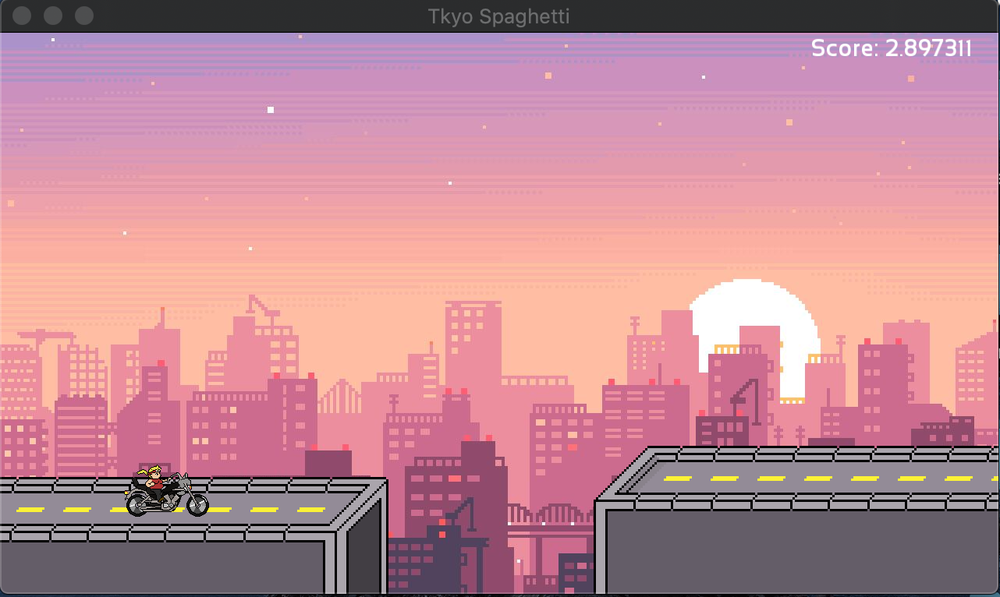

# TkyoSpaghetti

This is an endless runner style game for the tkyosam fam. 



How to clone:

```
git clone --recurse-submodules https://github.com/Reesy/TkyoSpaghetti
```

This project imports it's dependency on SFML via a git submodule in the external_resources folder.

How to build:

Cmake is required to build this project, aswell as ensuring a suitable C++ compiler

To build a release (on OSX):

```
cmake .
make
```

To build for browser with Emscripten (requires emscripten installed and on the path): 

```
emcmake cmake . -B build 
```

To build with debug symbols (on OSX):
```
cmake -DCMAKE_BUILD_TYPE=Debug .
make
```

This project comes with a .vscode folder prebundled to make debugging easier, for this to work two plugins are necessary 

<dl>
    <dt> Recommended Plugins<dt>
    <dd style='color:green'>C/C++ Plugin </dd>
    <dd style='color:green'>CodeLLDB* </dd>
<dl>

Emscripten command (manually):
    ```emcc src/main.cpp -s WASM=1 -s USE_SDL=2 -s USE_SDL_IMAGE=2 -O3 -o index.js```

Running in small httpserver with Python 2: 
    ```python -m SimpleHTTPServer 8080``` 


\*CodeLLDB is only recommended for debugging on modern OSX versions

SFML can be found http://www.sfml-dev.org

Art By: Brandon

Background Found here: https://wallpaperaccess.com/pixel-city

Music By: https://soundcloud.com/victor-bui-trong 
Collision sound: https://freesound.org/people/JustInvoke/sounds/446125/ 
Jump sound: https://freesound.org/people/elektroproleter/sounds/157568/
